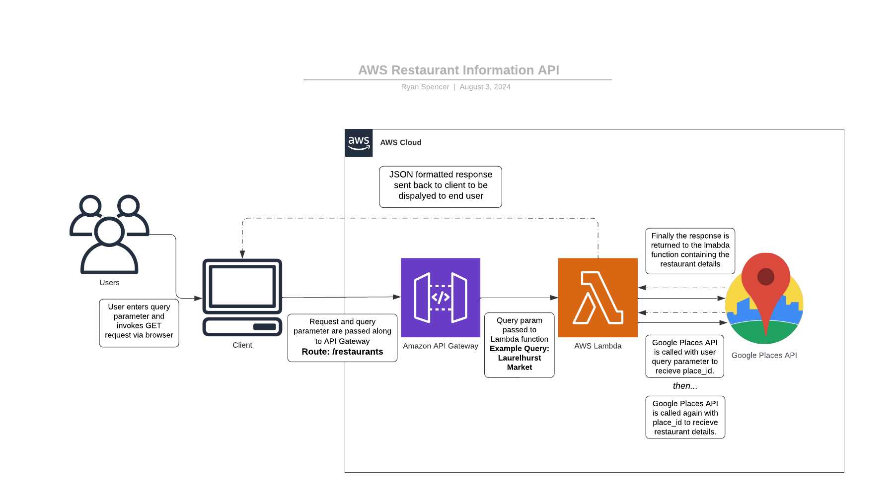

# Restaurant Details Microservice

This repository contains an AWS Lambda function that retrieves details of a restaurant using the Google Places API. The API accepts a single string as a query parameter.

## Structure

- `lambda_function.py`: The main Lambda function code.
- `requirements.txt`: List of dependencies.
- `.gitignore`: Git ignore file.
- `README.md`: Project description and setup instructions.

## Communication Contract

### Requesting Data from the Microservice

To request data from the microservice, make a GET request to the below endpoint. The request accepts a single query parameter labeled `restaurant_name`

#### Route:

```html
https://8tq8xw2094.execute-api.us-west-2.amazonaws.com/prod/restaurants?restaurant_name=RESTAURANT_NAME
```

Replace the value placeholder titled RESTAURANT_NAME with the actual name of the restaurant you would like information about.

#### Example Request (Restaurant Name):

```html
https://8tq8xw2094.execute-api.us-west-2.amazonaws.com/prod/restaurants?restaurant_name=Laurelhurst+Market
```

The query can also be a more specific string if you are looking for a specific restaurant location.

#### Example Request (Restaurant Name + Location):

```html
https://8tq8xw2094.execute-api.us-west-2.amazonaws.com/prod/restaurants?restaurant_name=Chipotle+Portland+Oregon
```

### Recieving Data from the Microservice

The API will respond with a JSON object containing the details of the restaurant, including place_id, name, rating, user_ratings_total, formatted_address, phone_number, website, open_now, hours, a single photo, and reviews. If a particular value does not exist for a key, the value will replaced be with the string "None." Recipents of the json data can use object notation to return specific values from the response.

#### Example Response

```json
{
  "place_id": "ChIJpbq0ZcCglVQRyCN9m__XcpY",
  "name": "Laurelhurst Market",
  "rating": 4.5,
  "user_ratings_total": 774,
  "formatted_address": "3155 E Burnside St, Portland, OR 97214, USA",
  "phone_number": "(503) 206-3097",
  "website": "http://www.laurelhurstmarket.com/",
  "open_now": true,
  "hours": [
    "Monday: 10:00 AM – 9:30 PM",
    "Tuesday: 10:00 AM – 9:30 PM",
    "Wednesday: 10:00 AM – 9:30 PM",
    "Thursday: 10:00 AM – 9:30 PM",
    "Friday: 10:00 AM – 9:30 PM",
    "Saturday: 10:00 AM – 9:30 PM",
    "Sunday: 10:00 AM – 9:00 PM"
  ],
  "photo": {
    "height": 680,
    "html_attributions": ["<a href=\"https://maps.google.com/maps/contrib/103857528971474918345\">Laurelhurst Market</a>"],
    "photo_reference": "AelY_CvY97upIc_NmluodC_EQjzSis9S3hX9j2nJALz1G9DYxPEYW5QPCad23o3bdU2xnI1lPwxcNmyFHa8crFsmnH4MQDj31WYi8yydgaF4L7kYmCGcGKA_bQArzkME38HO1AKdgTiUkywvvxE7mQ870S7ZH6BwRC71V_WHDx0RUuC49etR",
    "width": 1024
  },
  "reviews": [...]
}
```

#### Example Usage:

```js
const callRestaurantAPI = async (restaurant_name) => {
  const response = await fetch(`https://8tq8xw2094.execute-api.us-west-2.amazonaws.com/prod/restaurants?restaurant_name=${restaurant_name}`);
  const data = await response.json();
  console.log("Name: ", data.name);
  console.log("Address: ", data.formatted_address);
  console.log("Phone Number: ", data.phone_number);
};
```

## UML Diagram



## License

MIT
